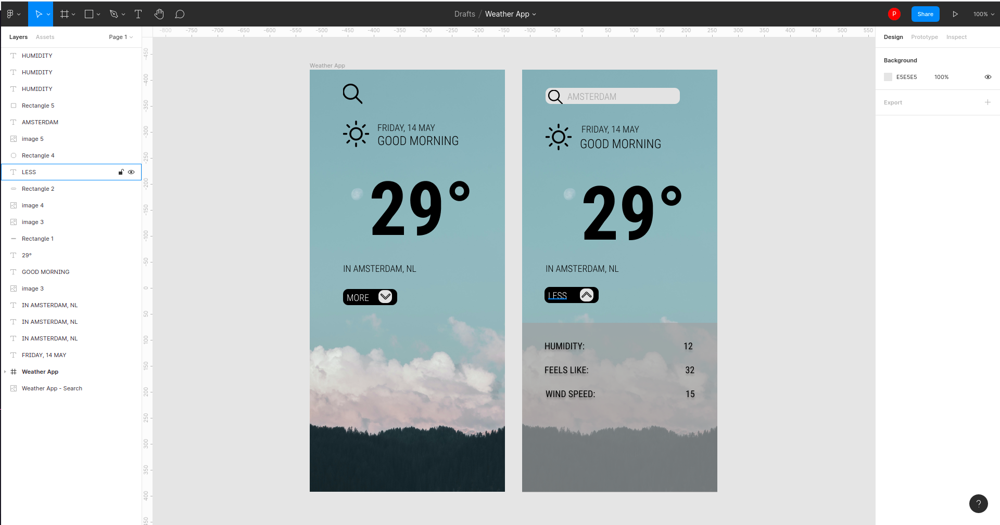

## :sunny: Weather App :cloud_with_rain:

An application used to get the weather forecast based on your location, built with React, JavaScript, and CSS.

## Project Status

:construction: In development.

## Installation and Setup Instructions

Clone down this repository. You will need `node` and `npm` installed globally on your machine.  

Installation:

`npm install`   

To Start Server:

`npm start`  

To Visit App:

`localhost:3000`

## Project Screenshot

